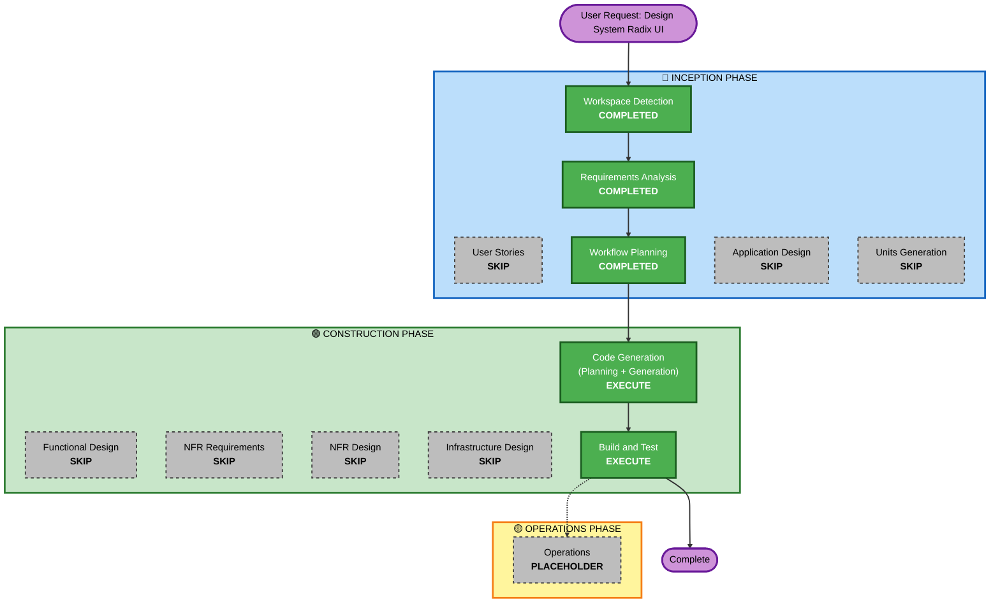

# Execution Plan — Ciclo 3: Design System basado en Radix UI

## Detailed Analysis Summary

### Transformation Scope (Brownfield)
- **Transformation Type**: Single-layer visual transformation (presentación/CSS), no arquitectónica
- **Primary Changes**: Sustitución de valores de color/tipografía/radio hardcodeados por tokens de Radix Colors/Themes en `css/style.css`, `index.html` (fuente Inter) y remaquetado de cada componente visual
- **Related Components**: Todo `src/**` (solo estilos, no lógica), `css/style.css`, `index.html`

### Change Impact Assessment
- **User-facing changes**: Sí — cambia el aspecto visual completo de la app (colores, tipografía, radios, modo oscuro)
- **Structural changes**: No — no cambia arquitectura, módulos ni flujo de datos
- **Data model changes**: No
- **API changes**: No
- **NFR impact**: Menor — accesibilidad de contraste (ya cubierta por diseño de Radix Colors), sin cambio de stack técnico

### Component Relationships
- **Primary Component**: `css/style.css` (tokens + reglas de todos los componentes)
- **Supporting Component**: `index.html` (carga de fuente Inter, `color-scheme`)
- **Dependent Components**: Todos los módulos de `src/**` que renderizan HTML con las clases CSS existentes (sin cambios de JS salvo ajustes mínimos de marcado si algún token lo requiere)
- **Test Components**: `tests/**` — no deberían verse afectados salvo que algún test dependa de un valor de estilo inline o de un `data-testid` que cambie de estructura (no previsto por FR-28.2)

### Risk Assessment
- **Risk Level**: Medium (alcance amplio — toca todos los componentes visuales — pero cambio de bajo riesgo técnico: solo CSS/tokens, sin lógica de negocio ni esquema de datos)
- **Rollback Complexity**: Easy (cambios acotados a CSS/HTML, revertibles con git)
- **Testing Complexity**: Moderate (228 tests existentes deben seguir en verde; la verificación visual es manual por parte del usuario, componente a componente, según NFR-12)

## Workflow Visualization

## Phases to Execute

### 🔵 INCEPTION PHASE
- [x] Workspace Detection (COMPLETED — sesión previa)
- [x] Requirements Analysis (COMPLETED)
- [ ] User Stories — SKIP
  - **Rationale**: Cambio puramente visual sin nuevos flujos de usuario, personas ni criterios de aceptación de negocio; no aporta valor (mismo criterio usado en Unidades 5/6/7)
- [x] Workflow Planning (IN PROGRESS — este documento)
- [ ] Application Design — SKIP
  - **Rationale**: No hay componentes/servicios nuevos ni capa de servicios propia; el "componente" aquí es CSS, no lógica de aplicación
- [ ] Units Generation — SKIP
  - **Rationale**: Es un único stream de trabajo coherente (tokens + remaquetado), no requiere descomposición en unidades paralelas independientes

### 🟢 CONSTRUCTION PHASE
- [ ] Functional Design — SKIP
  - **Rationale**: No hay entidades de dominio, reglas de negocio ni modelos de datos nuevos que diseñar; FR-24 a FR-28 ya son suficientemente concretos para pasar a implementación
- [ ] NFR Requirements — SKIP
  - **Rationale**: Sin cambio de stack técnico ni NFR nuevas más allá de las ya fijadas en NFR-12 a NFR-14 (Requirements Analysis)
- [ ] NFR Design — SKIP
  - **Rationale**: Depende de NFR Requirements, que se omite
- [ ] Infrastructure Design — SKIP
  - **Rationale**: Sin cambios de infraestructura (Vercel/Supabase no se ven afectados); la única adición externa es el `<link>` a Google Fonts para Inter, que no requiere diseño de infraestructura
- [ ] Code Generation — EXECUTE (ALWAYS)
  - **Rationale**: Implementación de tokens y remaquetado de componentes, en lotes con checkpoints de revisión visual (NFR-12)
- [ ] Build and Test — EXECUTE (ALWAYS)
  - **Rationale**: Verificar que los 228 tests existentes siguen en verde y que el build no se rompe

### 🟡 OPERATIONS PHASE
- [ ] Operations — PLACEHOLDER

## Estrategia de lotes para Code Generation

Dado el alcance amplio (FR-28.1), Code Generation se ejecutará en lotes con checkpoints de aprobación, en vez de un único paso monolítico:

1. **Lote 0 — Fundaciones**: tokens de color (Lime/Sand, claro+oscuro), tipografía (Inter + escala), radios, en `css/style.css` (o archivo de tokens separado). Sin cambios visuales aplicados aún a componentes.
2. **Lote 1 — Componentes base**: tarjetas (`.card`), botones/acciones, chips, formulario de producto/inputs.
3. **Lote 2 — Componentes de listas**: `list-card`, filas de producto, barra de selección en lote.
4. **Lote 3 — Modales e historial**: `common/modal.js` (estilos), tickets, historial, estadísticas.
5. **Lote 4 — Onboarding/QR y detalles finales**: pantallas de onboarding, ajustes finales, revisión de modo oscuro end-to-end.

Cada lote termina con: `npm test` en verde + aviso al usuario para verificación visual manual (NFR-12) antes de continuar al siguiente lote.

## Success Criteria
- **Primary Goal**: La app usa un design system coherente inspirado en Radix UI (color Lime/Sand, tipografía Inter, escala de radios, modo oscuro) en todos sus componentes visuales
- **Key Deliverables**: Tokens CSS documentados, `css/style.css` remaquetado, `index.html` con Inter, modo oscuro funcional
- **Quality Gates**: 228/228 tests en verde, `npm run build` exitoso, verificación visual manual del usuario por lote
