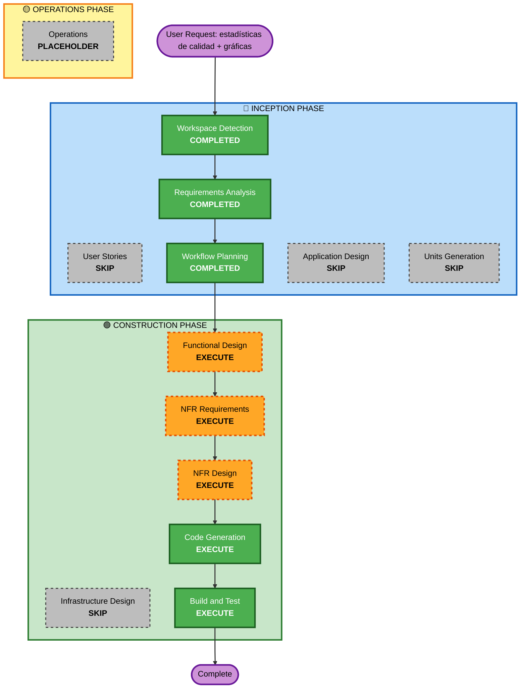

# Execution Plan — Ciclo 5: Estadísticas de calidad con gráficas

## Detailed Analysis Summary

### Transformation Scope (Brownfield)
- **Transformation Type**: Single component change (`src/stats/` únicamente)
- **Primary Changes**: Sustituir 3 secciones de texto por gráficas (barras horizontales, donut, barras) y añadir una sección nueva (evolución temporal, gráfico de líneas)
- **Related Components**: `stats-page.js` (orquestador), `calculations.js` (funciones puras, se añade una nueva), `stats-ranking.js`, `stats-distribution.js`, `stats-cadence.js` (sin cambio de tipo de gráfica), `css/tokens.css` (colores para las gráficas)

### Change Impact Assessment
- **User-facing changes**: Sí — la pantalla de estadísticas pasa de listas de texto a gráficas visuales, más una sección nueva
- **Structural changes**: No — mismo módulo `src/stats/`, mismo punto de entrada (`stats-page.js`)
- **Data model changes**: No — sin migración de esquema (NFR-19)
- **API changes**: No — misma consulta a Supabase ya existente
- **NFR impact**: Sí — se introduce una dependencia npm nueva (librería de gráficos), primera excepción a "sin dependencias de UI" en el proyecto

### Component Relationships
- **Primary Component**: `src/stats/`
- **Shared Components**: `css/tokens.css` (tokens de color M3 reutilizados, sin cambios)
- **Dependent Components**: Ninguno depende de `src/stats/` (hoja del árbol de componentes)
- **Supporting Components**: `common/skeleton.js` (reutilizado sin cambios para el estado de carga)

### Risk Assessment
- **Risk Level**: Low — cambio aislado a un componente, sin tocar datos ni otras pantallas
- **Rollback Complexity**: Easy — revertir el paquete npm y los 4 ficheros de `src/stats/`
- **Testing Complexity**: Moderate — la librería de gráficos debe poder testearse con Vitest/jsdom (a validar en NFR Requirements)

## Workflow Visualization

## Phases to Execute

### 🔵 INCEPTION PHASE
- [x] Workspace Detection (COMPLETED)
- [x] Requirements Analysis (COMPLETED)
- [x] User Stories — SKIP
  - **Rationale**: Enhancement de una pantalla ya cubierta por historias de la Unidad 3; sin personas nuevas ni journeys de usuario nuevos, solo presentación distinta de datos ya definidos
- [x] Execution Plan (this document)
- [ ] Application Design — SKIP
  - **Rationale**: Sin capa de servicios propia (Supabase gestionado, patrón ya establecido); no se crean componentes/servicios nuevos, solo componentes de presentación dentro de `src/stats/`
- [ ] Units Generation — SKIP
  - **Rationale**: Cambio de un único componente existente (`src/stats/`), sin nuevos paquetes ni modelos de datos

### 🟢 CONSTRUCTION PHASE
- [ ] Functional Design — EXECUTE
  - **Rationale**: Nueva lógica de negocio (agregación temporal por mes/semana) y nuevos componentes de presentación (gráficas) que requieren definir su contrato de datos
- [ ] NFR Requirements — EXECUTE
  - **Rationale**: Decisión de tech stack pendiente de concretar (qué librería de gráficos, versión, tamaño de bundle, compatibilidad con Vitest/jsdom) — excepción a NFR-8/13 que merece justificación explícita
- [ ] NFR Design — EXECUTE
  - **Rationale**: Patrón de integración de la librería con los tokens de color M3 (claro/oscuro) y con el ciclo de vida de los componentes existentes (skeleton, Realtime si aplica)
- [ ] Infrastructure Design — SKIP
  - **Rationale**: Sin cambios de infraestructura real (mismo Vercel+Supabase); añadir una dependencia npm no requiere diseño de infraestructura
- [ ] Code Generation — EXECUTE (ALWAYS)
  - **Rationale**: Implementación de las gráficas y la nueva sección de evolución temporal
- [ ] Build and Test — EXECUTE (ALWAYS)
  - **Rationale**: Verificación de tests existentes + nuevos, build, y npm audit sobre la dependencia nueva

### 🟡 OPERATIONS PHASE
- [ ] Operations — PLACEHOLDER

## Success Criteria
- **Primary Goal**: La pantalla de estadísticas muestra gráficas (no listas de texto) para ranking, distribución por persona/día, y una nueva sección de evolución temporal
- **Key Deliverables**: Componentes de gráfica en `src/stats/`, función de agregación temporal en `calculations.js`, dependencia de gráficos añadida a `package.json`, tests actualizados/nuevos
- **Quality Gates**: `npm test` en verde, `npm run build` sin errores nuevos, gráficas legibles en modo claro y oscuro, `npm audit` sin vulnerabilidades nuevas de la dependencia añadida
