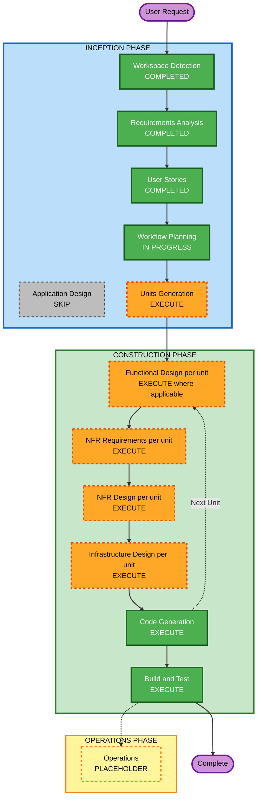

# Execution Plan — Lista de la Compra Compartida

## Detailed Analysis Summary

### Transformation Scope
- **Project Type**: Greenfield (no existing code)
- **Primary Changes**: N/A (new project)

### Change Impact Assessment
- **User-facing changes**: Sí — toda la aplicación es nueva funcionalidad de cara al usuario.
- **Structural changes**: Sí — se crea la arquitectura desde cero (frontend + Supabase).
- **Data model changes**: Sí — nuevo esquema (`households`, `products`).
- **API changes**: N/A a nivel de API custom — se usa la API autogenerada de Supabase; sí hay diseño de políticas RLS (control de acceso a nivel de fila).
- **NFR impact**: Sí — extensión de Seguridad activa (bloqueante), PBT en modo parcial.

### Risk Assessment
- **Risk Level**: Low — proyecto personal aislado, sin usuarios externos, capa gratuita, rollback trivial (redeploy).
- **Rollback Complexity**: Easy
- **Testing Complexity**: Simple-a-Moderate (lógica de estadísticas requiere algo más de cuidado; PBT parcial cubre esa parte)

## Workflow Visualization



### Text Alternative
```
INCEPTION
- Workspace Detection: COMPLETED
- Requirements Analysis: COMPLETED
- User Stories: COMPLETED
- Workflow Planning: IN PROGRESS (this document)
- Application Design: SKIP
- Units Generation: EXECUTE

CONSTRUCTION (per unit)
- Functional Design: EXECUTE where the unit has new data model / business logic
- NFR Requirements: EXECUTE (Security Baseline activo, PBT parcial)
- NFR Design: EXECUTE
- Infrastructure Design: EXECUTE (Supabase + hosting)
- Code Generation: EXECUTE (always)
- Build and Test: EXECUTE (always, after all units)

OPERATIONS
- Placeholder
```

## Phases to Execute

### INCEPTION PHASE
- [x] Workspace Detection (COMPLETED)
- [x] Requirements Analysis (COMPLETED)
- [x] User Stories (COMPLETED)
- [x] Workflow Planning (IN PROGRESS — this document)
- [ ] Application Design — **SKIP**
  - **Rationale**: No hay una capa de servicios/backend propia que diseñar: el backend es Supabase (Postgres + API autogenerada + Realtime), y el frontend es una única aplicación web sin múltiples componentes/servicios internos que requieran definición de métodos o dependencias entre servicios.
- [ ] Units Generation — **EXECUTE**
  - **Rationale**: El propio brief ya propone 4 "Bolts" naturales (Setup+CRUD, Realtime+selección múltiple, Historial+Estadísticas, Onboarding+QR+PWA) que mapean bien a unidades de trabajo secuenciales con dependencias claras (cada unidad se apoya en el esquema de datos de la unidad 1).

### CONSTRUCTION PHASE (por unidad, se re-evalúa en el loop per-unit)
- [ ] Functional Design — **EXECUTE** para unidades con nuevo modelo de datos o lógica de negocio (Unidad 1: esquema de datos; Unidad 3: cálculo de cadencia media y agregaciones estadísticas)
  - **Rationale**: Hay modelo de datos nuevo y lógica de negocio no trivial (cálculo de cadencia entre compras) que se benefician de diseño explícito antes de codificar.
- [ ] NFR Requirements — **EXECUTE**
  - **Rationale**: Extensión de Seguridad activa (bloqueante) requiere decisiones de tech stack para cumplir SECURITY-01/04/05/08/09/10; PBT en modo parcial requiere seleccionar framework (PBT-09).
- [ ] NFR Design — **EXECUTE**
  - **Rationale**: Diseño de políticas RLS de Supabase (control de acceso por `household_id`), cabeceras de seguridad en el hosting, y patrones de validación de inputs.
- [ ] Infrastructure Design — **EXECUTE**
  - **Rationale**: Hay que mapear a servicios reales concretos: proyecto Supabase (tablas, RLS, Realtime), hosting Vercel/Netlify, variables de entorno/despliegue.
- [ ] Code Generation — **EXECUTE (ALWAYS)**
  - **Rationale**: Implementación y generación de código necesaria para cada unidad.
- [ ] Build and Test — **EXECUTE (ALWAYS)**
  - **Rationale**: Verificación necesaria tras completar todas las unidades.

### OPERATIONS PHASE
- [ ] Operations — PLACEHOLDER

## Unidades de trabajo propuestas (alineadas con los Bolts del brief)
1. **Unidad 1 — Fundaciones**: Setup Supabase, esquema de datos (`households`, `products`), CRUD básico de pendientes (sin tiempo real todavía).
2. **Unidad 2 — Tiempo real y acciones en lote**: Supabase Realtime, selección múltiple, acción "marcar comprados".
3. **Unidad 3 — Historial y estadísticas**: vista de historial con filtros y corrección, cálculo de estadísticas (ranking, cadencia, distribución).
4. **Unidad 4 — Onboarding y acceso**: nombre local, creación de hogar, generación de QR, pulido UI/UX móvil, PWA opcional.

**Dependencias**: Unidad 2, 3 y 4 dependen del esquema de datos de la Unidad 1. Unidad 3 depende de que existan datos con `bought_at`/`bought_by` (generados por Unidad 2). Unidad 4 puede desarrollarse en paralelo a partir de la Unidad 1 (el flujo de creación de hogar es prerequisito real de uso, pero no bloquea el desarrollo de las otras unidades).

## Estimated Timeline
- **Total Phases**: 2 (Inception ya casi completo; Construction con 4 unidades)
- **Estimated Duration**: Horas por unidad, según el propio brief (Bolts de "horas" cada uno)

## Success Criteria
- **Primary Goal**: App funcional de lista de la compra compartida, accesible por QR, con tiempo real, selección múltiple e historial/estadísticas.
- **Key Deliverables**: Esquema Supabase + RLS, app web (vanilla JS) desplegada, historial y estadísticas funcionando con datos reales.
- **Quality Gates**: Cumplimiento de reglas SECURITY-* aplicables (no N/A), PBT-02/03/07/08/09 en la lógica de estadísticas, criterios de aceptación de las 13 historias de usuario verificados.
